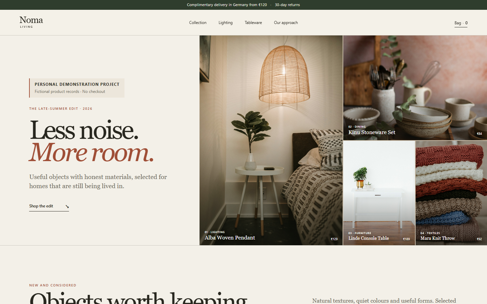
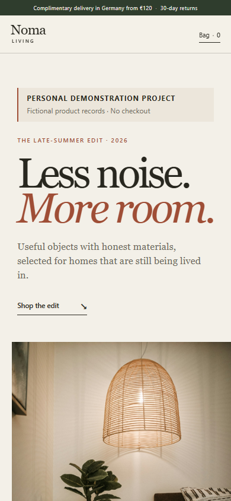

# Noma Living

Noma Living is a small, photo-led storefront built around a catalog migration problem: messy source rows should not reach a new shop with duplicate identifiers, invalid prices or unsafe legacy links.

> **Personal Demonstration Project.** All product records are fictional and checkout is intentionally unavailable. This is not a real retailer or client launch.

The live footer links directly to this source repository and its CI history so the storefront can be checked from the same page a portfolio reviewer opens.



## The problem

A visual redesign is only useful if the underlying catalog is safe to publish. The storefront therefore needed two things at once:

- a calm, editorial shopping experience that works on desktop and mobile;
- a deterministic release gate for product data and redirects.

## The workflow

The catalog module cleans names and identifiers, normalizes slugs and prices, blocks duplicate SKUs, reports duplicate slugs and missing images, and builds redirects only for safe local paths. The browser layer uses the approved rows for search, category filtering and a checkout-free bag.

The interface is deliberately unlike an admin dashboard. The first desktop view presents all four products as an asymmetric retail edit; the mobile layout starts with the brand story and a single lead photograph before the catalog.

## Evidence

- 6 deterministic domain tests;
- 3 static public-contract tests and 6 browser checks across the two required viewports;
- syntax checks for application, test and maintenance JavaScript;
- four catalog rows and four validated local redirects;
- working search, category, empty-result and bag states;
- browser regression coverage at 1440×900 and 390×844 for the visible project boundary, skip-link focus, exact Source/CI URLs, 44×44 CSS-pixel evidence targets and horizontal overflow;
- responsive captures at 1440×900 and 390×844;
- no framework, runtime dependency, analytics, payment integration or external write;
- no runtime network request for fonts or images.



## Run locally

The storefront is static, but ES modules should be served over HTTP rather than opened directly from the filesystem. The included dependency-free runtime server listens only on your local machine.

```bash
corepack enable
pnpm install --frozen-lockfile
pnpm run demo
```

Then open `http://127.0.0.1:4173/`.

## Test

Node.js 24 LTS is used in CI.

```bash
pnpm run gate
```

The gate checks the exact public-file manifest, JavaScript syntax, 9 Node tests and 6 browser checks in pinned Playwright 1.62.1 with its pinned Chromium runtime. It runs at both 1440×900 and 390×844. CI installs that runtime with `pnpm exec playwright install --with-deps chromium` before the gate.

To intentionally refresh the review evidence after a UI change:

```bash
pnpm run screenshots:update
pnpm run manifest:update
pnpm run gate
```

Release-facing changes are recorded in [CHANGELOG.md](CHANGELOG.md).

## Project boundary

This is a personal demonstration project. Noma Living, the products, SKUs, prices, catalog and contact address are fictional. Checkout is intentionally unavailable. It was not commissioned work, paid client work or a real retailer launch.

The four bundled product photographs are real stock photographs used under the Unsplash License. Their creators, source pages, license and retrieval date are listed in [ASSET-LICENSES.md](ASSET-LICENSES.md). The photographers did not create work for Noma Living and do not endorse this fictional brand.

The original interface and code are published for portfolio review under [PORTFOLIO-REVIEW-LICENSE.md](PORTFOLIO-REVIEW-LICENSE.md). That notice does not replace or restrict the separate licenses for third-party photographs.
